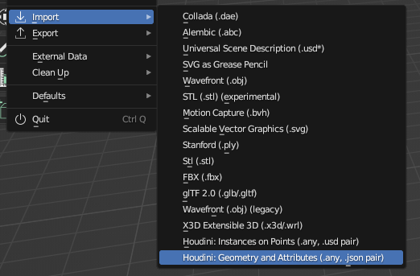
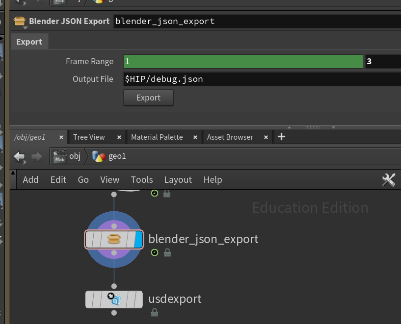
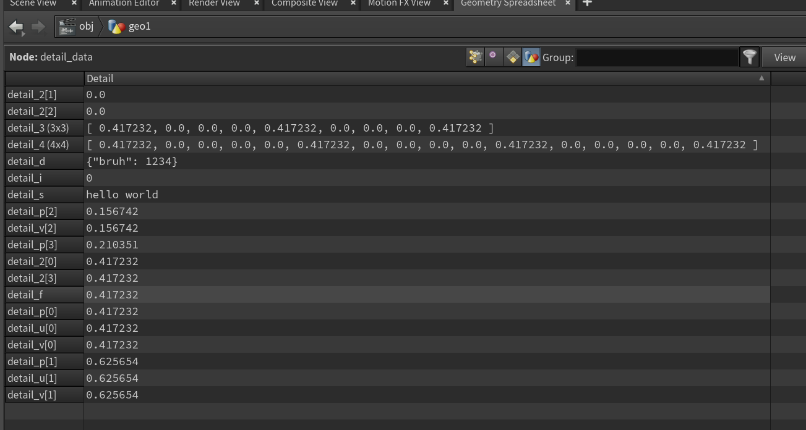
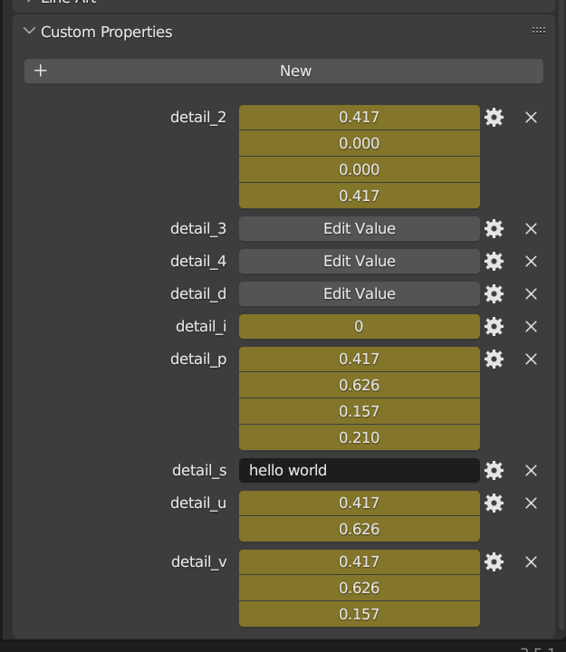
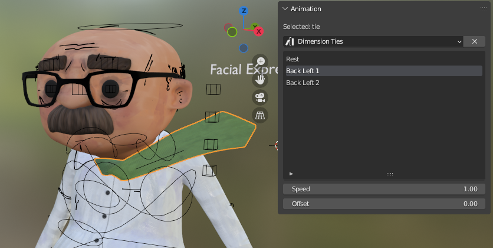
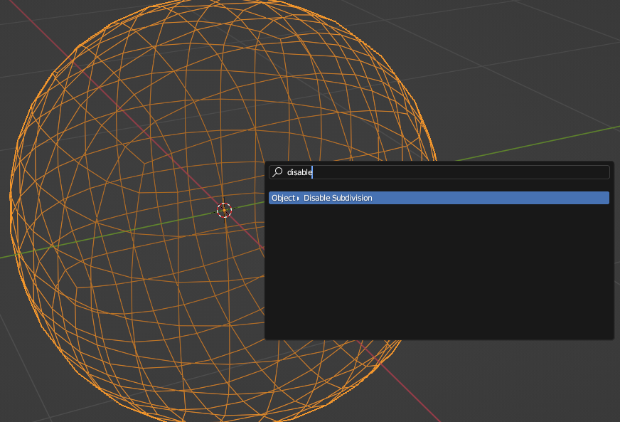

# Houdini Tools
Scripts and tools I made at UTS Animal Logic Academy, mostly for data transfer between Blender and Houdini.

## [Houdini Tools](houdini_tools.py)

A Blender addon which adds importing options for Houdini.

### Instances on Points

Blender's USD importer doesn't import instances correctly. It has two options: import realized geometry or import the points only.

Instances on Points fixes this, correctly importing instances as Blender should. It takes a point cloud and geometry to instance, imports the points as USD, then re-instances the geometry on each point.

Blender's USD importer used to do this, but they removed it for some reason. Please add it back!

### Geometry and Attributes

Blender's Alembic importer is extremely limited. It ignores most attributes and only imports vertex colors correctly. This means you need to force all attributes to be colours, which is [extremely hacky](https://www.youtube.com/watch?v=1h15stU-TaE).

I wanted to find a better solution. My first idea was manually exporting attributes from Houdini in an intermediate format, then manually reattaching them using Blender's Python API. This is exactly what I did.

I wrote a [Python script](blender_json_export.py) to export detail, prim, point and vertex attributes from Houdini per frame into a JSON file. I packaged this script into the [Blender JSON Export HDA](blender_json_export.hdanc).

Next I wrote an importer which takes the geometry and JSON file, then transfers the attributes using Blender's Python API. It works for all types of animated detail attributes, which are imported as custom data.

|Houdini|Blender|
|---|---|
|||

Unfortunately it can't import prim, vertex or point attributes. Geometry-level attributes can't be set using Blender's Python API, so I can't transfer them properly. This is a shame as it was the main goal of the project.

## [No Cloth Sims](no_cloth_sims.py)

A Blender addon used extensively for Gary's tie in the short film [Coffee Brake](https://youtu.be/T57aCLYdX9M), named after the fact we weren't supposed to have cloth sims in the film.

|No Cloth Sims|No Cloth Sims Lite|
|---|---|
|||

| [Watch Video](https://youtu.be/ycKYr1Sdmwg) |
| --- |

It contains lots of utilities to speed up assembly for cloth FX. Its main purpose is adding a Mesh Sequence Cache to the tie, stripping the vertex weights and rebaking the Alembic in world space. This saved me over 50 shots of manual work.

I made a reduced version for other departments to use named [No Cloth Sims Lite](no_cloth_sims_lite.py). It was used for most shots in the [dimension sequence](https://youtu.be/T57aCLYdX9M?si=XX9xdrUEsF8jwQMv&t=102), where each artist made a unique scene based on a template animation. This saved another 15 shots of manual work.

## [Disable Subdivision](disable_subdiv.py)

A simple utility to disable subdivision on selected objects. I used it constantly to avoid giant Alembic files and mismatching topology.

