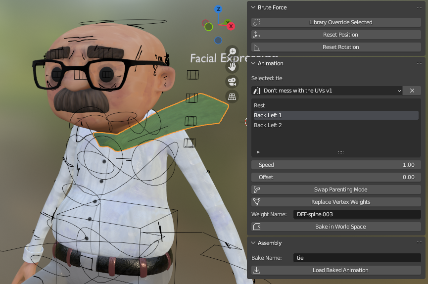

# Houdini Tools
Scripts and tools I made at UTS Animal Logic Academy, mostly for data transfer between Blender and Houdini.

## [No Cloth Sims](no_cloth_sims.py)

A Blender addon used extensively for the tie FX in the short film [Coffee Brake](https://youtu.be/T57aCLYdX9M).

It contains lots of fun utilities to speed up assembly for cloth FX. Its main purpose is adding a Mesh Sequence Cache to the tie, stripping the vertex weights and rebaking the Alembic. This saved over 50 shots of manual work in the final film.

I released a simplified version of this script for other departments to use named [No Cloth Sims Lite](no_cloth_sims_lite.py). It was used for the dimension sequence where each artist worked on a scene independently, saving another 15 shots of manual work.
